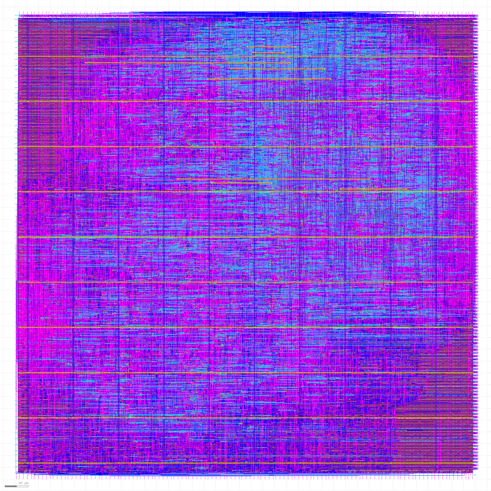

# 🛠️ RTL to GDSII Flow with Custom Inverter Cell on Sky130 & PicoRV32 Integration

This repository demonstrates a full **RTL to GDSII ASIC design flow** using the **SkyWater 130nm** PDK. It includes:

- 🧱 Design and characterization of a **custom inverter standard cell** (`sky130_vsdin`)
- 🔬 SPICE-based analysis and verification using **Magic** and **NGSPICE**
- 🔗 Seamless integration of the cell into a **RISC-V core (`PicoRV32`)**
- 🚀 RTL to GDSII flow using **[OpenLane](https://github.com/The-OpenROAD-Project/OpenLane)** and **OpenROAD**

---

---


## 🔧 Part 1: Custom Standard Cell Creation & Characterization

This section outlines the process we followed to design, simulate, and characterize our **custom inverter cell**. The layout methodology and characterization flow were **inspired by the open-source repository [`vsdstdcelldesign`](https://github.com/nickson-jose/vsdstdcelldesign)**, which served as a valuable reference during the development of our standard cell.


---

### ✅ Step 1: Clone the Custom Inverter Layout Repository

```bash
# Navigate to your OpenLane working directory
cd ~/Desktop/work/tools/openlane_working_dir/openlane

# Clone the inverter layout GitHub repo
git clone https://github.com/nickson-jose/vsdstdcelldesign

# Move into the cloned repo
cd vsdstdcelldesign

# Copy the Magic tech file for Sky130
cp ~/Desktop/work/tools/openlane_working_dir/pdks/sky130A/libs.tech/magic/sky130A.tech .

# Confirm the files
ls

# Open layout in Magic
magic -T sky130A.tech sky130_inv.mag &
````

---

### 🧪 Step 2: SPICE Netlist Extraction via Magic

Once inside the Magic GUI:

1. Run **Design Rule Check (DRC)**:

   ```tcl
   drc why
   ```

2. Extract the layout and generate the **SPICE netlist**:

   ```tcl
   extract all
   ext2spice cthresh 0
   ext2spice
   ```

📦 Output: A `sky130_inv.spice` netlist for simulation.

---

### 📐 Step 3: Characterize the Inverter Using NGSPICE

Inside the `CustomCell/` directory, we provide a spice netlist with libraries  for:

* 📈 DC Transfer Characteristics
* ⏱️ Transient Response (Rise/Fall Delay)
* ⚡ Power Consumption

#### ▶️ Run the Simulation:

```bash
# Navigate to the testbench directory
cd CustomCell

# Launch NGSPICE to simulate
ngspice sky130_inv.spice
```

✨ The waveform output and power/delay metrics can be used for cell library generation or integration.

---

## 📚 External Links & Tools

* 🔗 [SkyWater Open PDK (Sky130)](https://github.com/google/skywater-pdk)
* 🧰 [OpenLane Flow](https://github.com/The-OpenROAD-Project/OpenLane)
* 💡 [PicoRV32 - Minimal RISC-V CPU Core](https://github.com/cliffordwolf/picorv32)
* 🧪 [Magic VLSI Layout Tool](http://opencircuitdesign.com/magic/)
* ⚙️ [NGSPICE Simulator](https://ngspice.sourceforge.io/)

---

# 🚀 RTL to GDSII Flow: Integrating Custom Inverter with PicoRV32 on Sky130

This section documents **Part 2** of the project, where we integrate our custom inverter into the **PicoRV32 RISC-V core** and perform a complete **RTL to GDSII flow** using the **OpenLane toolchain** with the **SkyWater 130nm PDK**.

We recommend using the following pre-built OpenLane working directory:
🔗 [OpenLane working environment by Fayiz Ferosh](https://github.com/fayizferosh/soc-design-and-planning-nasscom-vsd/tree/main/Desktop/work/tools/openlane_working_dir)

All required tools and dependencies are already downloaded in this environment.

---

## 🐳 Launch OpenLane using Docker

Use the command below to launch OpenLane from Docker:

```bash
sudo docker run -it --rm \
-v /home/iraj/VLSI/openlane_working_dir/openlane:/openLANE_flow \
-v /home/iraj/VLSI/openlane_working_dir/openlane/pdks:/home/iraj/VLSI/openlane_working_dir/openlane/pdks \
-e PDK_ROOT=/home/iraj/VLSI/openlane_working_dir/openlane/pdks \
-u 0:0 efabless/openlane:v0.15
```

### 🔍 Explanation:

* `-it`: Runs an interactive terminal session
* `--rm`: Automatically removes the container after exit
* `-v`: Mounts host directories into Docker (code and PDKs)
* `-e PDK_ROOT=...`: Specifies the PDK root directory
* `-u 0:0`: Runs Docker as root user
* `efabless/openlane:v0.15`: Specifies the OpenLane version

---

## 📁 Replace the PicoRV32 Folder

Replace the default `picorv32a` folder in the OpenLane `designs` directory with **your custom `picorv32a` folder**.

```bash
cd Desktop/work/tools/openlane_working_dir/openlane
```

---

## 🧪 OpenLane Interactive Flow

```bash
./flow.tcl -interactive
```

```tcl
package require openlane 0.9
```

### 🔧 Prep the Design

```tcl
prep -design picorv32a -tag 04-07_04-38 -overwrite
```

You can either reuse an existing run directory (`runs/04-07_04-38`) or generate a fresh one:

```tcl
prep -design picorv32a
```
```bash
set lefs [glob $::env(DESIGN_DIR)/src/*.lef]
add_lefs -src $lefs
```
```bash
set ::env(SYNTH_STRATEGY) "DELAY 3"
```
```bash
set ::env(SYNTH_SIZING) 1
```

---

## 🧠 Step-by-Step Flow Explanation

Sure! Here's a **clean and well-organized version** of your synthesis section, separating the **command**, **synthesis result summary**, and **timing report** with proper markdown formatting. This is ideal for a `README.md` or documentation.

---

## 🔧 1️⃣ Synthesis Step

### ▶️ Command to Run Synthesis

```bash
run_synthesis
```

---

## 📊 Synthesis Summary

### 📌 Top Module: `picorv32a`

| Metric                            | Value              |
| --------------------------------- | ------------------ |
| Number of wires                   | 22,757             |
| Number of wire bits               | 23,139             |
| Number of public wires            | 1,565              |
| Number of public wire bits        | 1,947              |
| Number of memories                | 0                  |
| Number of memory bits             | 0                  |
| Number of processes               | 0                  |
| **Total cells**                   | **23,037**         |
| **Custom cells (sky130\_vsdinv)** | **2,166**          |
| **Chip area**                     | **209,181.87 µm²** |

<details>
<summary>📦 Notable Standard Cells Used</summary>

| Cell Name                  | Count |
| -------------------------- | ----- |
| `sky130_fd_sc_hd__dfxtp_2` | 1613  |
| `sky130_fd_sc_hd__nand2_2` | 3394  |
| `sky130_fd_sc_hd__nand3_2` | 2128  |
| `sky130_fd_sc_hd__nor2_2`  | 1887  |
| `sky130_fd_sc_hd__and2_2`  | 492   |
| `sky130_fd_sc_hd__mux2_1`  | 1224  |
| `sky130_fd_sc_hd__mux2_2`  | 902   |
| `sky130_fd_sc_hd__buf_1`   | 1644  |
| `sky130_fd_sc_hd__inv_2`   | 98    |
| `sky130_vsdinv` *(custom)* | 2166  |

</details>

---

## ⏱ Timing Report (STA)

### 🔹 Hold Time Check (Min Path)

| Metric     | Value                  |
| ---------- | ---------------------- |
| Startpoint | `resetn` (input)       |
| Endpoint   | `_42736_` (FF D-input) |
| Slack      | ✅ `+0.09` ns           |

---

### 🔻 Setup Time Check (Max Path)

| Metric                     | Value                     |
| -------------------------- | ------------------------- |
| Startpoint                 | `_42923_` (FF Q-output)   |
| Endpoint                   | `_42703_` (FF D-input)    |
| Slack                      | ❌ `-2.95` ns *(VIOLATED)* |
| TNS (Total Negative Slack) | `-266.40` ns              |
| WNS (Worst Negative Slack) | `-2.95` ns                |

---

### ✅ Final Status:

```tcl
[INFO]: Synthesis was successful
```


🔹 Converts RTL (Verilog) into a gate-level netlist using a standard cell library.
🔹 Performs optimizations and maps the logic to physical cells.

---

### 2️⃣ Floorplanning and IO Placement


```tcl
init_floorplan
place_io
tap_decap_or
```


🔹 Creates a chip outline, defines core area and margins.
🔹 Places IO pins around the core.
🔹 Adds tap and decap cells for well-tap and power integrity.

---

### 3️⃣ Placement

Running placement
```tcl
run_placement
```

🔹 Automatically places standard cells within the floorplan.


---

### 4️⃣ Clock Tree Synthesis (CTS)

```tcl
unset ::env(LIB_CTS)
run_cts
```

🔹 Adds buffers/inverters to balance clock signal delays (skew).
🔹 Ensures the clock reaches all flip-flops in sync.


---

### 5️⃣ Power Distribution Network (PDN)

```tcl
gen_pdn
```

🔹 Creates VDD and GND grid to distribute power.
🔹 Essential for avoiding IR drop and powering the whole chip.

View PDN in Magic:

```bash
cd home/VLSI/openlane_working_dir/openlane/designs/picorv32a/runs/04-07_04-38/tmp/floorplan/
magic -T home/VLSI/openlane_working_dir/pdks/sky130A/libs.tech/magic/sky130A.tech \
lef read ../../tmp/merged.lef def read 14-pdn.def &
```

---

### 6️⃣ Routing (TritonRoute)

```tcl
run_routing
```

🔹 Connects all placed cells and pins using metal layers.
🔹 Ensures DRC-clean signal paths.

To view routed DEF in Magic:

```bash
cd home/VLSI/openlane_working_dir/openlane/designs/picorv32a/runs/04-07_04-38/results/routing/
magic -T home/VLSI/openlane_working_dir/pdks/sky130A/libs.tech/magic/sky130A.tech \
lef read ../../tmp/merged.lef def read picorv32a.def &
```


## ⏱️ Post-Route Timing Analysis with OpenSTA

```tcl
openroad
read_lef /openLANE_flow/designs/picorv32a/runs/04-07_04-38/tmp/merged.lef
read_def /openLANE_flow/designs/picorv32a/runs/04-07_04-38/results/routing/picorv32a.def
write_db pico_route.db
read_db pico_route.db
read_verilog /openLANE_flow/designs/picorv32a/runs/04-07_04-38/results/synthesis/picorv32a.synthesis_preroute.v
read_liberty $::env(LIB_SYNTH_COMPLETE)
link_design picorv32a
read_sdc /openLANE_flow/designs/picorv32a/src/my_base.sdc
set_propagated_clock [all_clocks]
read_spef /openLANE_flow/designs/picorv32a/runs/04-07_04-38/results/routing/picorv32a.spef
report_checks -path_delay min_max -fields {slew trans net cap input_pins} -format full_clock_expanded -digits 4
exit
```

### 📈 Why Timing Analysis?

* Validates that signal arrival times meet setup/hold constraints.
* Ensures clock domain timing is safe.

---

## 🎯 Final Layout View



---


```


